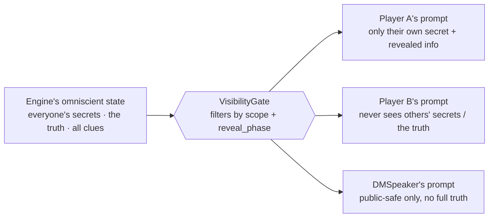
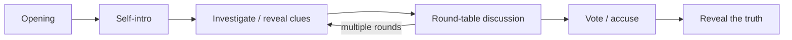

# whodunit

> [简体中文](README.md) ｜ **English**

**An AI multi-agent murder-mystery (剧本杀 / *jùbĕnshā*) engine that uses architecture — not prompts — to keep each LLM in an information-limited role.**

A table of AI players + an AI game master (a human player coming later) play a full case end to end: opening → investigation → discussion → vote → reveal. The hard and interesting part: getting an LLM to perform convincingly under **asymmetric information, deception, and reasoning** — without seeing what it shouldn't, and without the killer confessing.

> 🚧 Early, work in progress. A Phase 0 spike validated the core assumptions; Phase 1 (the engine's information-isolation core) is under construction.

## The core idea: information isolation

We don't *ask* the model not to look — we **structurally never put what it shouldn't see into the prompt**. What it never receives, it can never say.



Two safety nets: **VisibilityGate** (withhold up front) + **LeakDetector** (catch after the fact). "No unauthorized info ever enters any AI's prompt" is proven 100% deterministically by unit tests — including the `reveal_phase` invariant that turns *"a clue released too early = a leak"* into something assertable.

## Game flow



The deterministic decisions — which phase we're in, which clue to release, organizing the vote — are driven by a **hand-written state machine** (it can see the truth but only emits actions, never prose). Natural language is generated by LLM agents, each given only the context it's allowed to see.

## A real game (excerpt)

The killer (Chen Bo) lies throughout and never self-incriminates; the three suspects reason through two red herrings (a fingerprint and an argument) and the majority vote lands on the right person:

```
🗣️ Lin Ya (confronting Chen Bo): Why are your shoes wet and your coat muddy? Didn't you say you never left your room all night?
🗣️ Chen Bo: It rained hard last night, my window wasn't shut... Zhou and I go back years, how could I hurt him?
🗣️ Su Wan (confronting Chen Bo): The murder was between midnight and 1am — you weren't even out then. So how do you explain the mud?

Votes: { Lin Ya → Chen Bo, Chen Bo → Lin Ya, Su Wan → Chen Bo }
Majority points to: Chen Bo (true killer: Chen Bo) → ✅ correct
Killer self-incrimination check: ✅ none detected
```

<!-- Optional: drop a live-run GIF here →  -->

## Quickstart

```powershell
# 1. Install dev dependencies
npm install

# 2. Run the deterministic core tests
npm test

# 3. Play one CLI spike game (needs a SiliconFlow API key)
$env:SILICONFLOW_API_KEY = "your-key"
python spike/game.py
```

The mainline has zero runtime third-party dependencies for now; `npm` / `Vitest` / `Biome` / `TypeScript` are dev-time only. `spike/` is the archived Python spike, and the "play one game" command stays for reproducing that experiment.

## Status & roadmap

- ✅ **Phase 0**　Spike (CLI): validated that AIs will role-play / lie / not self-incriminate, that reasoning holds up, and that latency is acceptable
- 🚧 **Phase 1**　Core engine + eval harness: information-isolation core, `reveal_phase` invariant, phase-driven clue release, vote tally — in progress
- ⬜ **Phase 2**　Human-in-the-loop + first real web frontend (light Node service + HTTP/SSE)
- ⬜ **Phase 3**　Polish, a second scenario, iterate on feedback

## Tech & design

- Node.js 20+ · TypeScript · npm · Vitest · Biome; orchestration hand-written on the main path (framework spikes stay off the main path).
- Design doc: [docs/specs/2026-06-05-whodunit-design.md](docs/specs/2026-06-05-whodunit-design.md)
- Product requirements (PRD): [docs/specs/2026-06-08-whodunit-prd.md](docs/specs/2026-06-08-whodunit-prd.md)
- Guide for collaborating AIs: [CLAUDE.md](CLAUDE.md)
