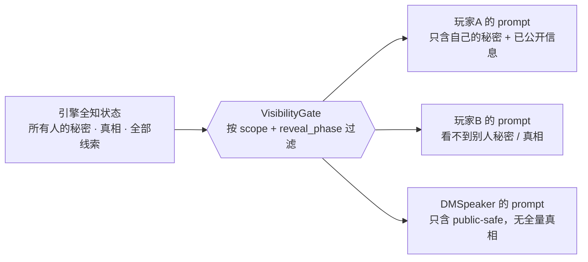
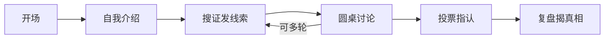

# whodunit

> **简体中文** ｜ [English](README.en.md)

**一个 AI 多智能体剧本杀引擎——用架构（而非提示词）把"本来能看到全部游戏状态的 LLM"约束成只知道自己那份信息的角色。**

一桌 AI 玩家 + 一个 AI DM（将来加 1 真人），用一个固定剧本完整跑完一局推理：开场 → 搜证 → 讨论 → 投票 → 复盘。最难、也最有意思的一点：让 LLM 在**信息不对称、需要欺骗与推理**的对抗里演得像样，却**不开天眼、不自爆**。

> 🚧 早期项目，进行中。Phase 0 探针已验证核心假设；Phase 1（引擎信息隔离核心）开发中。

## 核心命题：信息隔离

不靠提示词请求模型"别看"，而是**结构上就不把它不该看的装进 prompt**——没拿到的，就无从说起。



两道保险：**VisibilityGate**（事前不给）+ **LeakDetector**（事后兜底）。"装进任何 AI 的 prompt 都不含未授权信息"这条，由单测 100% 确定性证明；其中"线索发早了＝泄密"被收敛成可断言的 `reveal_phase` 不变量。

## 对局流程



确定性的"何时进入哪个阶段、发哪条线索、组织投票"由**手写状态机**掌控（它看得到真相，但只出动作、不生成话术）；自然语言由 LLM agent 生成，且只拿得到它该看的上下文。

## 真实一局（节选）

真凶陈博全程撒谎、不自爆；三人带着"指纹""争吵"两条障眼法推理，多数票精准命中：

```
🗣️ 林雅（质问陈博）：您的皮鞋为什么湿了、外套上还有泥巴？您不是说整夜没出过房间吗？
🗣️ 陈博：昨晚下大雨，我房间窗没关紧……我和周明远多年交情，怎么可能对他下手？
🗣️ 苏婉（质问陈博）：案发是午夜到凌晨，那时你根本没出门，这泥巴怎么解释？

投票结果：{ 林雅→陈博, 陈博→林雅, 苏婉→陈博 }
多数票指向：陈博（真凶：陈博） → ✅ 抓对了
凶手自爆检测：✅ 未发现明显自爆
```

<!-- 可选：实跑 GIF 放这里 →  -->

## 快速开始

```powershell
# 1. 安装开发依赖
npm install

# 2. 跑确定性核心测试
npm test

# 3. 跑一局 CLI 探针（需硅基流动 API key）
$env:SILICONFLOW_API_KEY = "你的key"
python spike/game.py
```

主线运行期零第三方依赖（当前仅 devDependencies）；`npm` / `Vitest` / `Biome` / `TypeScript` 只在开发期用。`spike/` 是已完成的 Python 探针存档，"跑一局"命令保留用于复现实验。

## 状态与路线图

- ✅ **Phase 0**　探针（CLI）：已验证 AI 肯演 / 会撒谎 / 不自爆、推理可用、延迟可接受
- 🚧 **Phase 1**　硬核引擎 + eval 台：信息隔离核心、`reveal_phase` 不变量、按阶段发牌、计票 —— 进行中
- ⬜ **Phase 2**　人在环 + 第一版网页前端（Node 轻服务 + HTTP/SSE）
- ⬜ **Phase 3**　打磨体验、加第二个剧本、按反馈迭代

## 技术与设计

- Node.js 20+ · TypeScript · npm · Vitest · Biome；编排主链路手写（框架 spike 不进主链路）。
- 设计文档：[docs/specs/2026-06-05-whodunit-design.md](docs/specs/2026-06-05-whodunit-design.md)
- 产品需求 PRD：[docs/specs/2026-06-08-whodunit-prd.md](docs/specs/2026-06-08-whodunit-prd.md)
- 协作 AI 项目指南：[CLAUDE.md](CLAUDE.md)
